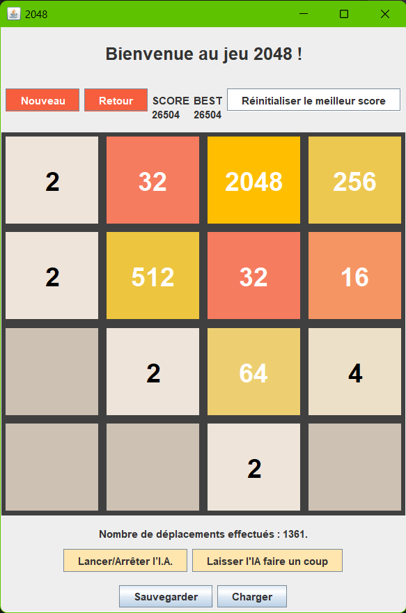

# Jeu 2048 -- IA de résolution
## Introduction
Ce projet réimplémente le célèbre **jeu 2048** créé en 2014 par un jeune étudiant en informatique : Gabriele Cerulli.

Nous ajoutons quelques extensions au jeu de base telles que :
- La sauvegarde d'une partie en cours
- Une IA de résolution inspirée de l'algorithme MCST (Monte Carlo Search Tree).





### Caractéristiques
Language : Java  
Bibliothèque graphique : SWING  
Année : 2021/2022 --  **L3 Informatique**

## Table des matières
1. [Arborescence du projet](#1---arborescence-du-projet)
2. [Lancement de l'application](#2---lancement-de-l'application)
3. [Règles du jeu](#3---règles-du-jeu)
4. [Comment jouer ?](#4---comment-jouer-)
5. [IA de résolution -- MCTS](#5---ia-de-résolution----mcts)
    1. [Principe](#principe)
    2. [Performance](#performance)

## 1-- Arborescence du projet

- **/data**  : Image du jeu 2048.
- **/out**      : Dossier contenant les fichiers compilés.
- **/src/modele**         : Classes de bases du modèle permettant de jouer au jeu 2048.
- **/src/vue_controleur**     : Classes permettant l'affichage du jeu et la gestion des évènements. Nous retrouvons d'ailleurs 2 versions : _Console2048.java_ (version texte) et _Swing2048.java_ (avec l'interface graphique).
- **Projet_2048.jar** : Exécutable du jeu 2048.
- **sauvegarde.txt** : Fichier de sauvegarde d'une partie en cours.


## 2-- Lancement de l'application
### Via l'executable
Après avoir téléchargé le fichier **Projet_2048.jar**, il suffit de lancer la commande suivante dans un terminal :
```bash
java -jar Projet_2048.jar
```

### Via l'IDE
Il est également possible de lancer l'application via un IDE depuis la classe Main.java_.

A noter que cela suppose l'installation de JAVA sur votre machine. (_version >=17_)

## 3-- Règles du jeu
- Le jeu 2048 se déroule sur une grille de 4x4 cases, créant ainsi un plateau de jeu de 16 cases au total.

- Au début du jeu, deux tuiles numérotées aléatoirement, souvent 2 ou 4, apparaissent sur le plateau.

- L'objectif principal du jeu est de combiner ces tuiles numérotées en les déplaçant sur le plateau pour atteindre la tuile portant le numéro 2048.

- Vous pouvez déplacer les tuiles dans quatre directions : vers le haut, vers le bas, vers la gauche ou vers la droite. Lorsque vous déplacez les tuiles, toutes les tuiles du plateau se déplacent dans la même direction jusqu'à ce qu'elles atteignent un bord ou se fusionnent avec une tuile de même valeur.

- Lorsque deux tuiles portant le même numéro se rencontrent en étant déplacées dans une direction, elles se combinent pour former une tuile avec le double de la valeur. Le but ultime est de continuer à combiner les tuiles pour atteindre la tuile 2048 tout en remplissant autant de cases que possible. Si le plateau est rempli et aucun mouvement n'est possible, la partie est terminée.

## 4-- Comment jouer ?
Après avoir lancer l'application, utilisez les flèches directionnelles de votre clavier pour déplacer les tuiles dans la direction souhaitée.

De nombreuses options de jeu sont disponibles :
- **Nouvelle partie** : Permet de lancer une nouvelle partie.
- **Retour** : Permet de revenir en arrière d'un coup.
- **Lancer/arrêter l'IA** : Permet de lancer ou d'arrêter l'IA de résolution.
- **Laisser l'IA faire un coup** : Permet de laisser l'IA faire un coup à votre place.
- **Sauvegarder** : Permet de sauvegarder la partie en cours dans un fichier texte stocké à l'emplacement de votre fichier .jar.
- **Charger** : Permet de charger une partie sauvegardée précédemment depuis un fichier txt.

## 5-- IA de résolution -- MCTS
### Principe
L'IA de résolution est inspirée de l'algorithme MCTS (Monte Carlo Search Tree). Pour prédire le meilleur "coup suivant", l'IA va alors simuler 400 parties complètes à partir de chaque coup possible (Haut, Bas, Gauche, Droite). A chaque fin de partie, l'IA va calculer un score en fonction de la somme des tuiles présentes sur le plateau. Le "coup suivant" ayant la meilleur moyenne de score sur l'ensemble des parties simulées sera alors choisi.

Bien évidemment, l'apparition de tuile étant aléatoire, il est possible que l'IA ne choisisse pas le meilleur coup si la nouvelle tuile apparait à un endroit délicat. Néanmoins, la moyenne de score calculée sur 400 parties, ce biais aléatoire reste très faible.

Une piste d'amélioration serait l'ajout d'heuristique pour guider l'IA dans ses choix.

### Performance
L'IA obtient des résultats performants pour résoudre le jeu de base : atteindre 2048. En effet, après 100 parties simulées, l'IA obtient un **taux de victoire supérieur à 95%.**

Dans 8% des cas, l'IA parvient à atteindre 4096.